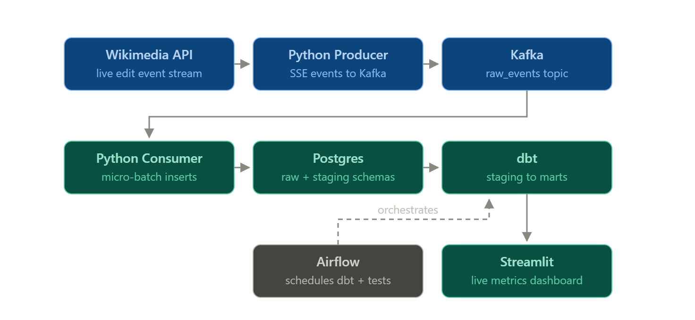

# wiki-stream-pipeline

Real-time data pipeline streaming Wikipedia edits end to end:
Wikimedia EventStreams → Kafka → Postgres → dbt → Airflow → Streamlit.

## Architecture


## Final Dashboard Sample:


## Stack
Kafka (KRaft) · Postgres · dbt · Airflow · Streamlit · Docker Compose · Python

## How it works

Data Ingestion: A Python producer subscribes to the Wikimedia EventStreams API
(Server-Sent Events) and publishes every edit event to a Kafka topic, keyed by
wiki so events from the same wiki preserve ordering within a partition. The
producer is fault-tolerant: if the long-lived HTTP connection drops, it flushes
pending messages and reconnects automatically

Storage: A Python consumer reads the topic in micro-batches (500 events or
5 seconds, whichever comes first) and inserts them into a raw Postgres table as
untouched JSONB, along with each message's Kafka partition and offset.

Transformation: dbt builds the analytics layer on top of raw: a staging
view extracts typed, renamed columns from the JSONB, and a fact table
aggregates edits per minute per wiki (total, bot vs human, net bytes changed).

Orchestration: An Airflow DAG runs `dbt run` and `dbt test` every 15
minutes, with retries, tests only execute if the build succeeds.

Data Serving: A Streamlit dashboard reads exclusively from the analytics
schema, showing live KPIs, edits per minute, and the most active wikis.

## Data quality
The pipeline delivers **at-least-once semantics with idempotent writes**,
which is effectively exactly-once at the database level:

- The consumer commits Kafka offsets only *after* the Postgres transaction
  commits. A crash mid-batch means Kafka redelivers — never data loss.
- Redelivered messages are absorbed by a unique constraint on
  `(kafka_partition, kafka_offset)` with `ON CONFLICT DO NOTHING`, so replays
  can't create duplicates.
- dbt tests run on every scheduled pipeline execution: primary-key uniqueness
  and not-null checks on staging, plus accepted-values guards on event types.
  A failed test halts the DAG before bad data reaches the dashboard.

## Running locally
** Setup **:
```python -m venv .venv```
```pip install -r requirements.txt```

```docker compose up -d```
```python producer/producer.py```
```python consumer/consumer.py```
```streamlit run dashboard/app.py```

